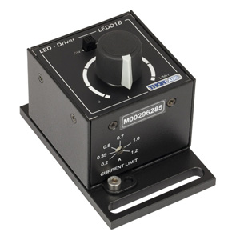
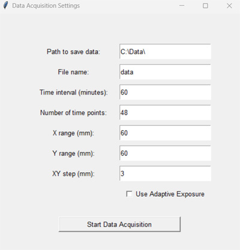

# Fluorescence Scanner Manual

## Table of Contents
- [Overview](#overview)
- [Hardware](#hardware)
  - [Arduino-Controlled XY Stage and LED](#arduino-controlled-xy-stage-and-led)
  - [CONEX-CC Translation Stage](#conex-cc-translation-stage)
  - [Fluorescence Imaging Module](#fluorescence-imaging-module)
- [Software](#software)
  - [Python Scanner GUI](#python-scanner-gui)
    - [Camera settings](#camera-settings)
    - [Set origin for the XY stage](#set-origin-for-the-xy-stage)
    - [Data acquisition](#data-acquisition)
  - [Arduino Control Code](#arduino-control-code)
  - [Other Software](#other-software)

---

## Overview

This repository contains the control code for a fluorescence scanner system designed for **timelapse imaging of large biological samples**.

The system integrates:
- An Arduino for controlling the XY stage and LED illumination,
- A CONEX-CC controller for Z-axis positioning,
- And IC Imaging Control for camera operation and image acquisition.

## Hardware

### Arduino-Controlled XY Stage and LED

The XY stage (LightObject LSR-PRO530XY with two NEMA 17 stepper motors powered by 24 V) and LEDs (Thorlabs M470L2, blue; Thorlabs M565L3, green) are controlled using an Arduino Uno R3. The Arduino pins are assigned as follows:

- `Pin 6`: `PUL` (pulse signal) for X motor  
- `Pin 7`: `DIR` (direction signal) for X motor  
- `Pin 8`: `DIR` for Y motor  
- `Pin 9`: `PUL` for Y motor  
- `Pin 11`: Blue LED  
- `Pin 12`: Green LED  

The LED controllers (Thorlabs LEDD1B) should be set to `TRIG` mode to enable external control via the Arduino.

### CONEX-CC Translation Stage

The entire fluorescence imaging module is mounted on a translational stage controlled by a CONEX Controller. It is also powered by the same 24 V power supply.

### Fluorescence Imaging Module

The fluorescence imaging system features two excitation lines:  
- The blue LED is filtered by a Thorlabs **[XX]** bandpass filter for GFP excitation  
- The green LED is filtered by a Thorlabs **FBH561-3** bandpass filter for RFP excitation  

The excitation beams are combined using a dichroic mirror (Thorlabs DMSP505) and directed to the sample via another dichroic mirror (Semrock Di01-R488/561).

Fluorescence emission is collected by an **[XX]** objective lens and filtered by a bandpass emission filter (Semrock FF01-523/610). A tube lens (f = 50 mm) forms the image on the camera (ImagingSource DMK 72BUC02).  
- Effective pixel size (object space): 1.98 µm  
- Default pixel size in saved images: 9.9 µm  
- Field of view (FOV): 3.85 × 5.13 mm²

---

## Software

The control code is available on GitHub:  
[github.com/zhangoumeng/rhizo_fluorescence_scanner](https://github.com/zhangoumeng/rhizo_fluorescence_scanner)

### Python Scanner GUI

### Main GUI Window

The main GUI window controls the scanner and displays live images:

- **XY Positioning**: Moves the microscope module horizontally to scan different areas of the sample.
- **Z Positioning**: Adjusts the vertical position of the microscope module to bring the sample into focus.
- **LED Control**: Turns the 470 nm (blue) and 565 nm (green) LEDs on or off.
- **Live View Panel**: The panel on the right displays the live camera feed for real-time visualization.

#### Camera settings

The camera settings define both the live view and the initial configuration for acquisition.  
For weak fluorescence, the highest gain (63) is recommended.  
Disable auto exposure and manually set the exposure time before acquisition.

#### Set origin for the XY stage

If the XY stage was moved while disconnected from the computer, you may need to reset its home position.

1. Check the `Bypass Limit` option  
2. Move the stage to the **front-left** corner  
3. Click `Home XY` to set this as the origin  

The internal travel limits:  
- X: 280 mm (left–right)  
- Y: 150 mm (back–forward)

#### Data acquisition

This window contains settings for XY-*t* scanning. Configurable parameters:
- File path and name  
- Time interval between scans  
- Number of time points  
- XY scan range and step size (default: 3 mm, ~22% FOV overlap)

**Scan start position**:  
The XY scan always begins from the **back-left** corner of the specified scan area.

**Adaptive exposure control**:  
When enabled, exposure time is halved if high intensities are detected, preventing saturation.  
Each FOV image, the stitched image, and an exposure time list are saved.

---

### Arduino Control Code

The Arduino moves motors with commands of the form `<number>x` or `<number>y`:

- `<number>x`: Move **Y** motor by `<number>/48` mm  
  - Positive → forward; Negative → backward  
- `<number>y`: Move **X** motor by `<number>/32` mm  
  - Positive → right; Negative → left  

> Note: the labels `x` and `y` are flipped relative to the actual stage axes.

**LED commands:**

- `a`: Turn on green LED  
- `b`: Turn off green LED  
- `c`: Turn on blue LED  
- `d`: Turn off blue LED  

---

### Other Software

#### CONEX-CC Utility

If the Z stage is unresponsive (even after clicking `Home Z`), use this utility to reset/enable the controller.

#### IC Capture

Default software for camera control. The Python GUI replicates its core functions, but *IC Capture* offers advanced image visualization options.

---
